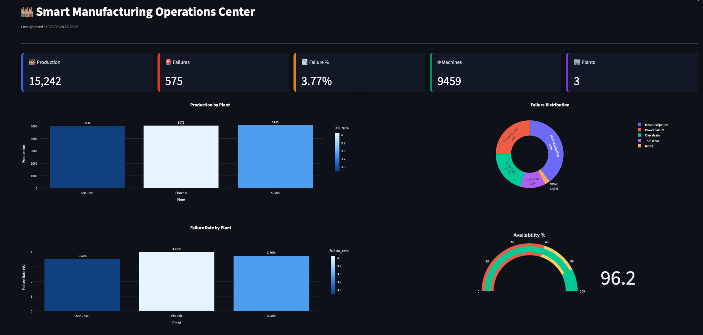

# 🏭 Smart Manufacturing Operations Platform

> A real-time manufacturing analytics platform built using **Kafka, Spark Structured Streaming, Delta Lake, and Streamlit** following the Medallion (Bronze, Silver, Gold) architecture.


---

# Overview

Modern manufacturing environments continuously generate machine telemetry that must be ingested, validated, transformed, and analyzed in real time.

This project demonstrates an end-to-end streaming analytics platform capable of processing manufacturing events from Kafka into a Delta Lake using a Medallion Architecture (Bronze → Silver → Gold) and presenting live operational KPIs through a Streamlit dashboard.

The platform is designed around real-world manufacturing use cases including:

- Predictive Maintenance
- Machine Health Monitoring
- Production Analytics
- Failure Analysis
- Executive KPI Reporting
- AI-ready Feature Engineering

  

---

# Architecture

```

Manufacturing Dataset
│
▼

Python Producer
│
▼

Confluent Cloud Kafka
│
▼

Spark Structured Streaming
│
▼

Bronze Layer (Raw Delta)
│
▼

Silver Layer (Validated + Enriched)
│
▼

Gold Layer (Business KPIs)
│
▼

Streamlit Dashboard

```

---

# Technology Stack

| Layer | Technology |
|---------|------------|
| Language | Python |
| Streaming | Apache Kafka (Confluent Cloud) |
| Processing | Apache Spark Structured Streaming |
| Storage | Delta Lake |
| Data Lake | Medallion Architecture |
| Dashboard | Streamlit |
| Visualization | Plotly |
| Data Quality | Custom Validation Rules |
| Feature Engineering | Spark |
| Cloud | Confluent Cloud |

---

# Project Structure

```

manufacturing-lakehouse/

├── producer/
│   ├── producer.py
│   ├── event_generator.py
│   └── config.py
│
├── spark-streaming/
│   ├── bronze_stream.py
│   ├── silver_stream.py
│   ├── gold_stream.py
│   ├── gold_metrics.py
│   ├── quality_rules.py
│   ├── transformations.py
│   ├── schema.py
│   ├── constants.py
│   └── export_gold.py
│
├── dashboard/
│   ├── app.py
│   ├── charts.py
│   ├── data_loader.py
│   └── data/
│
├── bronze/
├── silver/
├── gold/
├── checkpoints/
│
├── screenshots/
├── architecture/
│
├── requirements.txt
└── README.md

```

---

# Medallion Architecture

## Bronze Layer

Raw streaming events are ingested directly from Kafka into Delta Lake.

Features

- Raw event ingestion
- Checkpointing
- Immutable storage
- Streaming append

---

## Silver Layer

Business transformations and data quality validation.

Features

- Schema validation
- Invalid record quarantine
- Temperature delta calculation
- Machine status derivation
- Maintenance status prediction
- Event timestamp enrichment

---

## Gold Layer

Business-ready KPIs for reporting.

Generated datasets include:

- Executive Dashboard
- Plant Performance
- Production Line Performance
- Machine Health
- Shift Performance
- Product Quality
- Failure Summary
- Maintenance Dashboard
- Pipeline Metrics
- OEE
- Maintenance Alerts
- ML Feature Store

---

# Dashboard

The Streamlit dashboard provides live operational visibility into the manufacturing environment.

Features include

### Executive KPIs

- Total Production
- Total Failures
- Failure Rate
- Machine Count

### Operations

- Production by Plant
- Failure Distribution
- OEE
- Plant Performance

### Maintenance

- Machine Health
- Maintenance Status
- Tool Wear Distribution

### Failure Analytics

- Failure Types
- Failure Rate
- Plant Comparison

---

# Machine Learning Ready

The platform generates an ML Feature Store containing engineered features suitable for predictive maintenance models.

Available features include

- RPM
- Torque
- Tool Wear
- Temperature Delta
- Product Type
- Maintenance Status
- Machine Status
- Machine Failure

These features can be directly consumed by XGBoost, Random Forest, or other predictive maintenance models.

---

# Business KPIs

The platform continuously computes

- Production Count
- Failure Count
- Failure Rate
- Average RPM
- Average Torque
- Average Tool Wear
- Temperature Delta
- Machine Health
- Maintenance Status
- OEE
- Pipeline Metrics

---

# Data Quality

Implemented quality checks include

- Missing Values
- Invalid RPM
- Invalid Torque
- Invalid Temperatures
- Invalid Tool Wear
- Unknown Failure Types

Invalid records are automatically quarantined.

---

# Running the Project

## 1 Start Producer

```bash
python producer.py
```

## 2 Start Bronze

```bash
python bronze_stream.py
```

## 3 Start Silver

```bash
python silver_stream.py
```

## 4 Start Gold

```bash
python gold_stream.py
```

## 5 Export Gold Tables

```bash
python export_gold.py
```

## 6 Start Dashboard

```bash
streamlit run app.py
```

---

# Sample Dashboard

```
screenshots/

dashboard.png

executive_dashboard.png

machine_health.png

failure_analysis.png
```

---

# Future Enhancements

- Docker Compose
- MLflow
- Predictive Maintenance Model
- Great Expectations
- Kubernetes Deployment
- CI/CD Pipeline
- Databricks Deployment
- Snowflake Integration
- Real IoT Sensor Data
- REST API

---

# Key Engineering Concepts Demonstrated

- Event Streaming
- Kafka Producers
- Structured Streaming
- Delta Lake
- Medallion Architecture
- Streaming Data Quality
- Feature Engineering
- Distributed Processing
- Real-time Analytics
- Manufacturing Intelligence

---

# Author

**Soumya Vaka**

Lead Data Engineer

Python • Spark • Kafka • Delta Lake • Snowflake • AWS • Stream Processing

